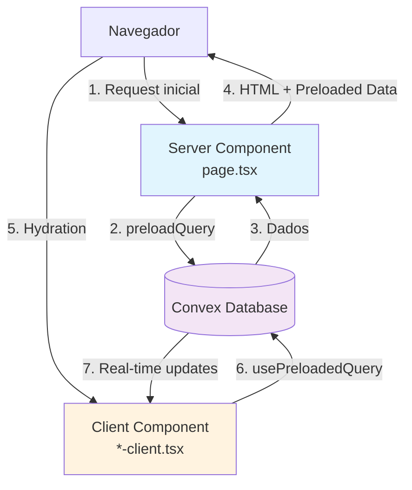

# PRD: Migração para Server Components com Convex

## Sumário Executivo

Este documento descreve o processo de conversão de páginas client-side para uma arquitetura híbrida usando Server Components do Next.js 13+ com Convex, seguindo a [documentação oficial do Convex para Next.js App Router](https://docs.convex.dev/client/nextjs/app-router/server-rendering).

**Implementação de Referência:** `app/(dashboard)/categories/`

## Objetivos

### Performance

- ✅ Eliminação do loading spinner inicial (server-side rendering)
- ✅ Redução do Time to First Byte (TTFB)
- ✅ Melhoria no Largest Contentful Paint (LCP)
- ✅ Manutenção da reatividade em tempo real após hidratação

### SEO

- ✅ Conteúdo renderizado no servidor para crawlers
- ✅ Meta tags dinâmicas baseadas em dados do Convex

### Developer Experience

- ✅ Código mais organizado e manutenível
- ✅ Separação clara entre server e client
- ✅ Otimização automática de imports (lucide-react)

## Arquitetura



## Estrutura de Arquivos

### Antes (Client-only)

```
categories/
├── page.tsx                    # "use client" - tudo no cliente
├── _components/
    ├── search-bar.tsx         # Client component
    ├── progress-bar.tsx       # Client component
    └── categories-card.tsx    # Client component
```

### Depois (Híbrido)

```
categories/
├── page.tsx                    # Server Component (sem "use client")
├── _components/
    ├── categories-client.tsx  # Client wrapper (NEW)
    ├── categories-grid.tsx    # Client component (NEW)
    ├── search-bar.tsx         # Client component
    ├── progress-bar.tsx       # Server-friendly component
    └── categories-card.tsx    # Client component
```

## Implementação Passo a Passo

### Passo 1: Configuração Inicial

#### 1.1. Adicionar otimização de imports no `next.config.ts`

```typescript
const nextConfig: NextConfig = {
  experimental: {
    serverActions: {
      bodySizeLimit: "100mb",
    },
    optimizePackageImports: ["lucide-react"], // ADICIONAR
  },
  // ... resto da config
};
```

**Benefício:** Elimina 200-800ms de cold start ao importar ícones.

#### 1.2. Atualizar `lib/tenant.ts` para aceitar slugs dinâmicos

```typescript
/**
 * Get the tenant slug from a hostname.
 * Returns the subdomain if found, otherwise falls back to default tenant.
 *
 * Note: This returns the actual subdomain from the hostname, even if it's not
 * in the static config. The static config is only used for UI branding fallbacks.
 * Tenant existence should be validated by querying the Convex database.
 */
export function getTenantSlugFromHostname(hostname: string): string {
  const subdomain = extractSubdomain(hostname);

  // Return the subdomain if it exists and looks valid (basic validation only)
  if (subdomain && /^[a-z0-9](?:[a-z0-9-]{0,48}[a-z0-9])?$/.test(subdomain)) {
    return subdomain;
  }

  return DEFAULT_TENANT_SLUG;
}
```

**Importante:** Não validar contra `tenantsConfig` estático. Validar apenas o formato.

#### 1.3. Atualizar `components/providers/tenant-provider.tsx`

Adicionar função de validação de formato:

```typescript
/**
 * Basic slug format validation (not checking static config)
 */
function isValidSlugFormat(slug: string): boolean {
  return /^[a-z0-9](?:[a-z0-9-]{0,48}[a-z0-9])?$/.test(slug.toLowerCase());
}
```

Substituir todas as chamadas de `isValidTenantSlug()` por `isValidSlugFormat()` no TenantProvider.

### Passo 2: Criar o Server Component Principal

**Arquivo:** `page.tsx`

```typescript
import { preloadQuery, fetchQuery } from "convex/nextjs";
import { api } from "@/convex/_generated/api";
import { auth } from "@clerk/nextjs/server";
import { headers } from "next/headers";
import { getTenantSlugFromHostname } from "@/lib/tenant";
import { YourClientPage } from "./_components/your-client";

export default async function YourPage() {
  // 1. Resolver tenant do hostname
  const headersList = await headers();
  const host = headersList.get("host") || "localhost";
  const tenantSlug = getTenantSlugFromHostname(host);

  console.log("[Your Page] Host:", host);
  console.log("[Your Page] Resolved tenant slug:", tenantSlug);

  // 2. Obter token de autenticação
  const { userId, getToken } = await auth();
  const token = await getToken({ template: "convex" }).catch(() => null);

  // 3. Buscar tenant do Convex
  const tenant = await fetchQuery(
    api.tenants.getBySlug,
    { slug: tenantSlug },
    token ? { token } : undefined,
  ).catch((error) => {
    console.error("[Your Page] Failed to fetch tenant:", error);
    return null;
  });

  // 4. Validar tenant existe
  if (!tenant) {
    console.error(`[Your Page] Tenant "${tenantSlug}" not found in database`);
    return (
      <div className="flex items-center justify-center h-screen">
        <div className="text-center">
          <p className="text-muted-foreground mb-2">
            Tenant &quot;{tenantSlug}&quot; not found
          </p>
          <p className="text-sm text-muted-foreground">Host: {host}</p>
        </div>
      </div>
    );
  }

  console.log("[Your Page] Tenant found:", tenant.slug, tenant._id);

  // 5. Preload dados principais (CRÍTICO - usar preloadQuery)
  const preloadedMainData = await preloadQuery(
    api.yourModule.yourQuery,
    { tenantId: tenant._id },
    token ? { token } : undefined,
  );

  // 6. Preload dados opcionais (se usuário autenticado)
  const preloadedUserData = userId
    ? await preloadQuery(
        api.yourModule.userSpecificQuery,
        { userId, tenantId: tenant._id },
        token ? { token } : undefined,
      ).catch(() => null)
    : null;

  // 7. Passar dados preloaded para client component
  return (
    <YourClientPage
      preloadedMainData={preloadedMainData}
      preloadedUserData={preloadedUserData}
    />
  );
}
```

### Passo 3: Criar o Client Component Wrapper

**Arquivo:** `_components/your-client.tsx`

```typescript
"use client";

import { Preloaded, usePreloadedQuery } from "convex/react";
import { api } from "@/convex/_generated/api";
import { useState } from "react";
import { useRouter } from "next/navigation";
import { SidebarTrigger, useSidebar } from "@/components/ui/sidebar";
import { useTenantQuery } from "@/hooks/use-tenant-convex";

export function YourClientPage({
  preloadedMainData,
  preloadedUserData,
}: {
  preloadedMainData: Preloaded<typeof api.yourModule.yourQuery>;
  preloadedUserData: Preloaded<typeof api.yourModule.userSpecificQuery> | null;
}) {
  // 1. Consumir dados preloaded (mantém reatividade)
  const mainData = usePreloadedQuery(preloadedMainData);
  const userData = preloadedUserData
    ? usePreloadedQuery(preloadedUserData)
    : null;

  // 2. Estado local para interações
  const [searchQuery, setSearchQuery] = useState("");
  const router = useRouter();
  const { state } = useSidebar();

  // 3. Queries adicionais reativas (client-side only)
  const searchResults = useTenantQuery(
    api.search.searchYourData,
    searchQuery ? { query: searchQuery } : "skip",
  );

  // 4. Handlers de eventos
  const handleSearch = (query: string) => setSearchQuery(query);
  const handleClick = (id: string) => {
    router.push(`/your-route/${id}`);
  };

  // 5. Renderizar UI
  return (
    <div className="min-h-screen relative">
      <SidebarTrigger
        className={`hidden md:inline-flex fixed top-2 h-6 w-6 text-blue-brand hover:text-blue-brand hover:bg-blue-brand transition-[left] duration-200 ease-linear z-10 ${
          state === "collapsed"
            ? "left-[calc(var(--sidebar-width-icon)+0.25rem)]"
            : "left-[calc(var(--sidebar-width)+0.25rem)]"
        }`}
      />

      <div className="px-12 sm:px-16 md:px-24 lg:px-24 xl:px-42 pb-24 md:pb-3 pt-8 md:pt-8">
        {/* Sua UI aqui */}
      </div>
    </div>
  );
}
```

### Passo 4: Extrair Componentes de UI (Opcional mas Recomendado)

**Arquivo:** `_components/your-grid.tsx`

```typescript
"use client";

interface Item {
  _id: string;
  title: string;
  // ... outros campos
}

export function YourGrid({
  items,
  isLoading,
  searchQuery,
  onItemClick,
}: {
  items: Item[];
  isLoading: boolean;
  searchQuery: string;
  onItemClick: (id: string) => void;
}) {
  if (isLoading) {
    return (
      <div className="flex items-center justify-center py-12">
        <div className="text-center">
          <div className="animate-spin rounded-full h-12 w-12 border-b-2 border-blue-brand mx-auto mb-4" />
          <p className="text-muted-foreground">Carregando...</p>
        </div>
      </div>
    );
  }

  if (items.length === 0) {
    return (
      <div className="col-span-full flex items-center justify-center py-20">
        <p className="text-muted-foreground text-center">
          {searchQuery ? "Nenhum resultado encontrado" : "Nenhum item encontrado"}
        </p>
      </div>
    );
  }

  return (
    <div className="grid grid-cols-1 sm:grid-cols-2 lg:grid-cols-3 gap-4 md:gap-6">
      {items.map((item) => (
        <YourCard
          key={item._id}
          {...item}
          onClick={() => onItemClick(item._id)}
        />
      ))}
    </div>
  );
}
```

### Passo 5: Atualizar Queries do Convex

**CRÍTICO:** Queries usadas com `useTenantQuery` DEVEM aceitar `tenantId`.

**Arquivo:** `convex/your-module.ts`

```typescript
import { v } from "convex/values";
import { query } from "./_generated/server";

export const yourQuery = query({
  args: { tenantId: v.id("tenants") },
  returns: v.array(
    v.object({
      _id: v.id("yourTable"),
      _creationTime: v.number(),
      tenantId: v.id("tenants"),
      title: v.string(),
      // ... outros campos
    }),
  ),
  handler: async (ctx, args) => {
    const items = await ctx.db
      .query("yourTable")
      .withIndex("by_tenantId_and_isPublished", (q) =>
        q.eq("tenantId", args.tenantId).eq("isPublished", true),
      )
      .collect();

    return items.sort((a, b) => a.position - b.position);
  },
});

// Query de busca TAMBÉM precisa de tenantId
export const searchYourData = query({
  args: {
    query: v.string(),
    tenantId: v.id("tenants"), // NECESSÁRIO para useTenantQuery
  },
  returns: v.array(
    v.object({
      _id: v.id("yourTable"),
      _creationTime: v.number(),
      tenantId: v.id("tenants"),
      title: v.string(),
      // ... outros campos
    }),
  ),
  handler: async (ctx, args) => {
    const searchQuery = args.query.toLowerCase().trim();

    const items = await ctx.db
      .query("yourTable")
      .withIndex("by_tenantId_and_isPublished", (q) =>
        q.eq("tenantId", args.tenantId).eq("isPublished", true),
      )
      .collect();

    if (!searchQuery) {
      return items.slice(0, 20);
    }

    return items
      .filter(
        (item) =>
          item.title.toLowerCase().includes(searchQuery) ||
          item.description.toLowerCase().includes(searchQuery),
      )
      .slice(0, 20);
  },
});
```

## Checklist de Implementação

### Preparação

- [ ] Adicionar `lucide-react` ao `optimizePackageImports` no `next.config.ts`
- [ ] Atualizar `lib/tenant.ts` para aceitar slugs dinâmicos
- [ ] Atualizar `components/providers/tenant-provider.tsx` com `isValidSlugFormat`

### Conversão da Página

- [ ] Remover `"use client"` do `page.tsx`
- [ ] Adicionar imports do Convex: `preloadQuery`, `fetchQuery`
- [ ] Adicionar imports do Next.js: `headers` from `next/headers`
- [ ] Adicionar import do Clerk: `auth` from `@clerk/nextjs/server`
- [ ] Implementar resolução de tenant no servidor
- [ ] Adicionar validação de tenant existe
- [ ] Implementar `preloadQuery` para dados principais
- [ ] Implementar `preloadQuery` para dados opcionais (se autenticado)
- [ ] Criar e passar props para client component

### Client Component

- [ ] Criar novo arquivo `*-client.tsx`
- [ ] Adicionar `"use client"` no topo
- [ ] Importar e tipar `Preloaded` do Convex
- [ ] Usar `usePreloadedQuery` para consumir dados preloaded
- [ ] Mover estado local e hooks do React para client component
- [ ] Manter queries reativas com `useTenantQuery`
- [ ] Implementar handlers de eventos

### Componentes de UI (Opcional)

- [ ] Extrair lógica de grid/lista para componente separado
- [ ] Implementar estados de loading/empty
- [ ] Usar `memo()` se necessário (ou confiar no React Compiler)

### Queries do Convex

- [ ] Adicionar `tenantId: v.id("tenants")` aos args de TODAS as queries usadas com `useTenantQuery`
- [ ] Adicionar `returns` com validador completo
- [ ] Usar índice `by_tenantId_and_*` nas queries
- [ ] Filtrar por `tenantId` no handler

### Testes

- [ ] Página carrega sem loading spinner inicial
- [ ] Dados aparecem imediatamente no primeiro render
- [ ] Busca funciona corretamente
- [ ] Navegação funciona
- [ ] Real-time updates funcionam (testar com duas abas)
- [ ] Console não tem erros
- [ ] Logs mostram tenant correto

## Problemas Comuns e Soluções

### Problema 1: "Tenant not found"

**Causa:** Slug do tenant não existe no banco de dados Convex.

**Solução:**

1. Verificar que o tenant existe no Convex: `api.tenants.list`
2. Verificar que o slug extraído está correto nos logs do console
3. Criar tenant no Convex se necessário

### Problema 2: "ArgumentValidationError: extra field tenantId"

**Causa:** Query do Convex não aceita `tenantId` mas está sendo chamada com `useTenantQuery`.

**Solução:**

```typescript
// ANTES (errado)
export const myQuery = query({
  args: { someField: v.string() },
  // ...
});

// DEPOIS (correto)
export const myQuery = query({
  args: {
    someField: v.string(),
    tenantId: v.id("tenants"), // ADICIONAR
  },
  // ...
});
```

### Problema 3: Dados não aparecem na primeira renderização

**Causa:** Usando `useQuery` ou `useTenantQuery` ao invés de `usePreloadedQuery`.

**Solução:**

```typescript
// ERRADO no client component
const data = useTenantQuery(api.myModule.myQuery, {});

// CORRETO
// 1. No server: preloadQuery
const preloadedData = await preloadQuery(api.myModule.myQuery, { tenantId });

// 2. No client: usePreloadedQuery
const data = usePreloadedQuery(preloadedData);
```

### Problema 4: TypeScript reclama de tipo `Preloaded`

**Solução:**

```typescript
import { Preloaded, usePreloadedQuery } from "convex/react";
import { api } from "@/convex/_generated/api";

// Tipar o prop corretamente
interface Props {
  preloadedData: Preloaded<typeof api.yourModule.yourQuery>;
}
```

### Problema 5: "Headers already sent" ou erro de streaming

**Causa:** Usando `await headers()` dentro de try-catch ou após operações assíncronas.

**Solução:** Chamar `headers()` no início da função, antes de qualquer `await`:

```typescript
export default async function Page() {
  // FAZER ISSO PRIMEIRO
  const headersList = await headers();
  const host = headersList.get("host") || "localhost";

  // Depois fazer o resto...
  const { userId, getToken } = await auth();
  // ...
}
```

## Benefícios Mensuráveis

### Performance

- **TTFB:** Redução de ~200-500ms (dados já no HTML)
- **LCP:** Redução de ~300-800ms (sem loading spinner)
- **FCP:** Redução de ~100-300ms (conteúdo renderizado no servidor)
- **Cold Start:** Redução de 200-800ms (otimização de imports)

### SEO

- ✅ Conteúdo indexável por crawlers
- ✅ Meta tags dinâmicas
- ✅ Structured data disponível no HTML

### UX

- ✅ Sem flash de loading spinner
- ✅ Conteúdo aparece instantaneamente
- ✅ Mantém reatividade após load

## Referências

- [Convex Next.js Server Rendering](https://docs.convex.dev/client/nextjs/app-router/server-rendering)
- [Next.js Server Components](https://nextjs.org/docs/app/building-your-application/rendering/server-components)
- [Vercel React Best Practices](https://vercel.com/blog/how-we-optimized-package-imports-in-next-js)
- [Implementação de Referência](<app/(dashboard)/categories/>)

## Próximos Passos

### Páginas Prioritárias para Migração

1. **Favorites** (`app/(dashboard)/favorites/`) - Similar à categories
2. **Units** (`app/(dashboard)/units/`) - Mais complexo, tem dependências
3. **Profile** (`app/(dashboard)/profile/`) - Já parcialmente implementado
4. **Admin pages** - Baixa prioridade (não são SEO-critical)

### Melhorias Futuras

- [ ] Adicionar `generateMetadata` para SEO dinâmico
- [ ] Implementar Streaming SSR com múltiplos Suspense boundaries
- [ ] Adicionar error boundaries específicos
- [ ] Implementar retry logic para queries que falham
- [ ] Adicionar analytics de performance (Web Vitals)

---

**Última atualização:** 2026-01-21  
**Versão:** 1.0.0  
**Autor:** Implementação baseada na conversão de `app/(dashboard)/categories/`
